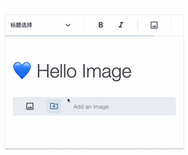

# Image Picker for Milkdown

Add support for select and upload pictures from file picker

<!--  -->



## Example Usage

```ts
import { Editor } from '@milkdown/core'
import { nord } from '@milkdown/theme-nord'
import { commonmark, heading, image, link } from '@milkdown/preset-commonmark'
import { imagePickerPreset, imagePickerView } from 'milkdown-plugin-image-picker'

Editor.make()
  .use(nord.override(imagePickerView))
  .use(commonmark.replace(image, imagePickerPreset()()))
  .create()
```

### Setup Uploader

```ts
import type { Uploader } from 'milkdown-plugin-image-picker'

const uploader: Uploader = async (files: FileList) => {
  /* Code */
}

Editor/* ... */.use(commonmark.replace(image, imagePickerPreset({
  uploader,
})()))
```
